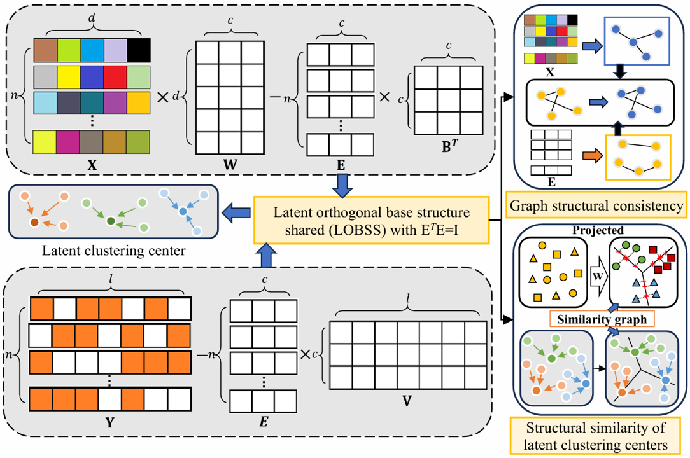

## SLOFS
## This is the relevant code for Multilabel Feature Selection via Shared Latent Sublabel Structure and Simultaneous Orthogonal Basis Clustering (SLOFS)
The article "Multilabel Feature Selection via Shared Latent Sublabel Structure and Simultaneous Orthogonal Basis Clustering" has been accepted by IEEE Transactions on Neural Networks and Learning Systems.

## Flow chart


## Citing
If you find this code useful, please consider to cite our work.
```
@article{shang2024multilabel,
  title={Multilabel Feature Selection via Shared Latent Sublabel Structure and Simultaneous Orthogonal Basis Clustering},
  author={Shang, Ronghua and Zhong, Jingyu and Zhang, Weitong and Xu, Songhua and Li, Yangyang},
  journal={IEEE Transactions on Neural Networks and Learning Systems},
  year={2025},
  volume={36},
  number={3},
  pages={5288-5303},
  publisher={IEEE}
}
```
